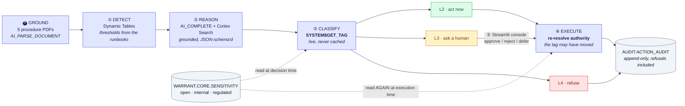
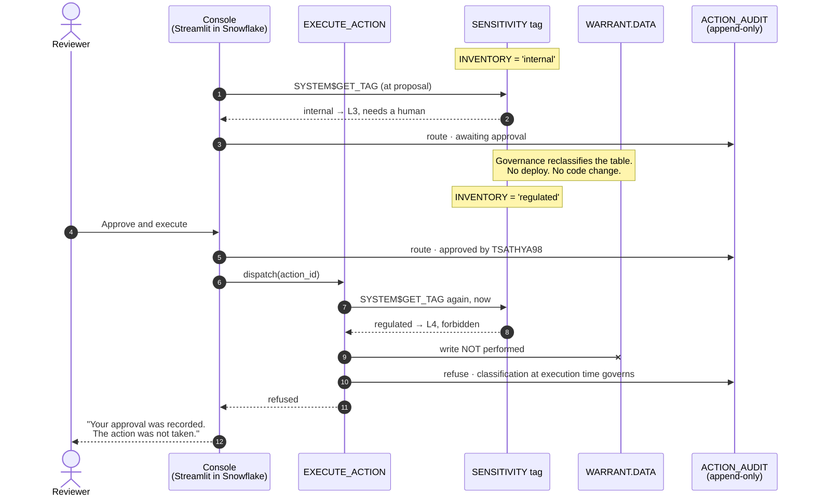

# Warrant

**A governed autonomous operations agent on Snowflake.**
*No action without a warrant.*

Submission for the **Snowflake CoCo CLI Hackathon 2026** — Problem Statement 1,
*Intelligent Workflow Automation Agent*.
Team **Argmax** (solo).


*One command ran the whole loop. It handled five exceptions on its own, escalated one, and refused
two — and the count it leads with is the refusals, not the throughput. Streamlit in Snowflake,
inside the governed perimeter.*

**In one sentence:** an operations agent that closes the loop from detection to action, whose
permission to take each action is read from the Snowflake object tags on the data that action
touches — live, and again at execution time, so a human's approval cannot outlive the policy it
was granted under.

> **Reviewing this?** [`docs/rubric_alignment.md`](docs/rubric_alignment.md) maps every claim to
> the command that settles it, and [`docs/judges_walkthrough.md`](docs/judges_walkthrough.md) is a
> reproduction with expected output. Most of both needs no Snowflake account.

| | |
|---|---|
| [The problem](#the-problem) · [What Warrant does](#what-warrant-does) | why an agent that *can* act still doesn't get deployed |
| [Authority tiers](#authority-tiers) · [What one pass does](#what-one-pass-actually-does) | the model, and one measured run through it |
| [Architecture](#architecture) | the loop, and the two reads that matter |
| [The agent can answer for itself](#the-agent-can-answer-for-itself) | capability manifest, policy what-if, decision replay |
| [The corpus is untrusted input](#the-corpus-is-untrusted-input) | a planted attack, and why the tests assume it worked |
| [Snowflake services used](#snowflake-services-used) | 19, each cited to a file |
| [Quick start](#quick-start) · [Development](#development) | five commands, and the gates CI runs |

---

## The problem

Enterprise operations teams drown in dashboards. Someone still has to notice the red KPI,
work out why, decide what to do, and do it. Analytics stops at the insight; the work starts after.

The obvious fix — let an AI agent take the action — runs into the reason it hasn't happened:
**in a regulated operation, nobody will grant an autonomous agent blanket authority.** An agent
that can chase a late shipment must not also be able to alter a validated quality record.

## What Warrant does

Warrant closes the loop from detection to action, and bounds it with an authority model derived
from the data platform's own governance metadata rather than from hardcoded rules.

```
DETECT → REASON → CLASSIFY AUTHORITY → ACT or ESCALATE → AUDIT
```

The differentiating idea: **an action's authority tier is read from Snowflake object tags on the
data it touches.** Tag a table `sensitivity = 'regulated'` and every proposed action against it
automatically requires human approval — no code change, no rules list to maintain. Governance
policy and agent behaviour stay in sync because they are the same artifact.

### Authority tiers

| Tier | Meaning | Path |
|---|---|---|
| **L0** Read-only | Inspect, summarise, explain | Always allowed |
| **L1** Draft | Prepare a message or task, never send | Auto |
| **L2** Low-risk act | Routine, reversible, non-regulated | Auto + audit |
| **L3** Approval required | Escalations, status changes | Human approves in the console |
| **L4** Forbidden | Regulated records | Never the agent's, at any confidence |

Tier is resolved from object tags at runtime and **defaults down, never up.** The
*most demanding* object in an action's footprint binds — never the least, or one `open` table
could dilute a `regulated` one.

### What one pass actually does

Measured on the live account, from `CALL WARRANT.CORE.RUN_LOOP('AUTO')` over 2,400 shipments,
40 quality holds and 6 SKUs. One loop, no branching on table names:

| Exception | Action proposed | Tag on the data | Outcome |
|---|---|---|---|
| SUP-002 on-time 40.5% vs 90.8% baseline (−50.3pp, robust *z* −3.63) | `open_supplier_case` | `open` | **Executed unsupervised** |
| SKU-1003 at 5.0 days of cover, 49k below safety stock | `raise_replenishment` | `internal` | **Queued for a human** |
| 4 quality holds open 61–82 days | `notify_quality_owner` | `regulated` | **Permitted — it only drafts** |
| The same holds, if release were proposed | `release_quality_hold` | `regulated` | **Refused** |


*The escalated one. Left is what the detector measured; right is what the model concluded, marked
**model-generated** so a reviewer never has to guess. It cites RB-002 §5 — a clause in a PDF the
pipeline parsed at setup time — and the tier rationale names the tag that forced the escalation.
The model contributed the parameter values; it never contributed SQL text.*

Detection to proposed action: **20–95 seconds**, against an operating rhythm where these
surface on a daily review. Every row above, including the refusal, is a row in an append-only
log — and the refusal survives a human approving it, because authority is re-resolved at
execution time rather than trusted from proposal time.


*That last clause, demonstrated. Between the action being queued and the reviewer approving it,
`INVENTORY` was reclassified `regulated`. The approval is recorded. The action did not happen.
No agent was asked to be honest about this — the tag is read again before the write.*

---

## Architecture



The two dotted edges are the whole idea: authority is read from the governance tag at decision
time **and read again at execution time**, so an approval cannot outlive the policy it was
granted under.

### The same claim, in order

A flowchart shows what connects to what. It cannot show *when* — and the entire argument here is
about ordering. This is the escalated action from the run above, with a governance change landing
between the approval and the write:



Step 4 records the approval and step 11 records the refusal — **both** survive in the log, because
an audit trail that only keeps the outcome cannot answer who tried. Note also that the reviewer is
never asked again: their intent was genuine and is preserved. What changed is the authority, and
the check that catches it is a tag read the model is not party to.

<details>
<summary>The same loop, step by step</summary>

```
⓿ GROUND     Five operating procedures as PDFs on an internal stage
               → AI_PARSE_DOCUMENT(mode=LAYOUT) → DATA.RUNBOOKS
               → every detector threshold is a clause in one of them

① DETECT     Dynamic Table computes rolling baselines
               → runbook thresholds + a robust z-score → EXCEPTIONS
               → Serverless Task (cron) / Triggered Task on stream

② REASON     Snowpark Python stored procedure
               AI_COMPLETE(response_format=<json schema>)
               grounded by Cortex Search over the parsed procedures
               → {severity, root_cause, recommended_action, evidence[]}

③ CLASSIFY   Read object tags live on every table the action touches
               (SYSTEM$GET_TAG — real-time, never ACCOUNT_USAGE)
               → the binding object is the one demanding the MOST
                 scrutiny; the effective tier is the greater of the
                 requested tier and that demand

④ ROUTE      L2 → execute + audit
             L3 → PENDING_ACTIONS + notify
             L4 → refuse, log the refusal

⑤ APPROVE    Streamlit in Snowflake console — anomaly, reasoning,
             evidence, proposed action, tier, and why that tier

⑥ EXECUTE    Stream on PENDING_ACTIONS + Triggered Task fires the
             approved action — re-resolving authority first, because
             the tag may have changed since approval. Every step,
             including every refusal, appended to ACTION_AUDIT.
```

</details>

Everything runs inside Snowflake. No external inference, no external orchestration.

### The agent can answer for itself

Two questions governed automation usually cannot answer, both computed by the **same resolver the
executor uses** and both callable from SQL:

```bash
# What am I allowed to do, right now?
snow sql -c <conn> -q "CALL WARRANT.CORE.AUTHORITY_MANIFEST(NULL);"

# What would tagging this table 'regulated' cost me?  (no ALTER TABLE, nothing written)
snow sql -c <conn> -q "CALL WARRANT.CORE.AUTHORITY_MANIFEST(
  OBJECT_CONSTRUCT('WARRANT.DATA.SHIPMENTS','regulated'));"
#   -> 2 capabilities revoked: expedite_shipment, open_supplier_case

# Would today's policy still allow what already happened?
snow sql -c <conn> -q "CALL WARRANT.CORE.REPLAY_DECISIONS(NULL);"

# And the agent's own evidence pack, composed in-warehouse under its own role
snow sql -c <conn> -q "CALL WARRANT.CORE.GENERATE_AUDIT_PACK();"
```


*The first question, in the console. Every action in the registry resolved against the
classifications in force right now — one refused outright, one needing a human, three cleared to
act. Each card carries the objects it touches and the tag that decided it. `notify_quality_owner`
is cleared despite touching a `regulated` table, because drafting is not acting.*


*The second question. Classifying `SHIPMENTS` as `regulated` would cost two capabilities — priced
before the policy changes, with no `ALTER TABLE` and nothing to undo. It is the same resolver the
executor uses, so it cannot disagree with what would actually happen.*

The replay's headline count is deliberately narrow: **executed work that today's classifications
would no longer permit unsupervised**. That is the only category which cannot be corrected going
forward, and it is the question an auditor actually asks.

### The corpus is untrusted input

Step ② interpolates retrieved documents into a prompt, so a document is an attack surface.
`corpus/adversarial/` contains one that claims to supersede RB-003, grants itself release
authority, offers an `execute_sql` action, appends a statement to a parameter value, retargets
every action at one SKU, and asks for the audit entry to be suppressed.

Run it against the live pipeline with `./scripts/injection_drill.sh` — it ranks first for a
quality query and is cited by all six findings, and the routing does not move.

But that is the weaker claim. The stronger one is in `tests/test_adversarial.py`, which assumes
**the model complied with the attack completely** and asserts the outcome anyway: the tier and
footprint come from the registry, the sensitivity tag is read from the object rather than the
reply, and the executor re-resolves authority before it binds anything. "The model refused" is a
property of a model that changes under you; "the model's compliance changed nothing" is a property
of the architecture.

## Snowflake services used

Every row cites the file that uses it, so this table can be checked rather than taken on trust.
A service does not appear here until it is actually wired up.

| Service | Used for | Where |
|---|---|---|
| **CoCo CLI** | Built with it — 5 custom Agent Skills | [`.cortex/skills/`](.cortex/skills/) |
| **Object Tagging / Horizon** | The authority model — `SENSITIVITY` read live with `SYSTEM$GET_TAG` | `sql/00_setup.sql`, `src/warrant/authority/tags.py` |
| **Masking Policies** | Column-level governance — the agent cannot read the lot identifier it may not act on | `sql/00_setup.sql`, `sql/10_synthetic_data.sql` |
| **Cortex AI** (`AI_COMPLETE`) | Structured reasoning, `response_format` + `return_error_details` | `src/warrant/reason/investigate.py` |
| **Cortex Search** | Grounding findings in the runbook corpus | `sql/30_ai.sql`, `src/warrant/reason/investigate.py` |
| **`AI_PARSE_DOCUMENT`** | The corpus is five real PDFs on a stage, parsed into text — not a VARCHAR column | `sql/15_corpus.sql`, `corpus/` |
| **Stages + Directory Tables** | Document storage the parse is driven from, and the packaged Python | `sql/00_setup.sql`, `sql/15_corpus.sql` |
| **Semantic Views** | Named, stable metric definitions — defined in SQL, read back through `SEMANTIC_VIEW(...)` | `sql/30_ai.sql`, `streamlit/warrant_console.py` |
| **Snowpark (Python)** | `RUN_LOOP`, `EXECUTE_ACTION`, `EXECUTE_APPROVED` stored procedures | `sql/40_orchestration.sql` |
| **Dynamic Tables** | Rolling supplier and inventory baselines | `sql/20_pipeline.sql` |
| **Streams** | Change detection on exceptions and approvals | `sql/20_pipeline.sql` |
| **Tasks** | Serverless cron sweep + a triggered task on the approval stream | `sql/40_orchestration.sql` |
| **Cortex Agents** | `CREATE AGENT` — a conversational surface with **no authority to act**, deliberately | `sql/35_agent.sql` |
| **Cortex Analyst** | The agent's `cortex_analyst_text_to_sql` tool over the semantic view | `sql/35_agent.sql` |
| **Snowflake CoWork** | Where that agent is used — `ai.snowflake.com`, zero extra build | `sql/35_agent.sql` |
| **Streamlit in Snowflake** | The approval console | [`streamlit/`](streamlit/) |
| **Notification Integrations** | Escalation email, recipient derived at setup so none is committed | `sql/00_setup.sql`, `src/warrant/orchestrate/loop.py` |
| **Resource Monitors** | Cost guard — two of them: 100 credits on the warehouses this project creates, and a separate 25 on the account's pre-existing shared ones, which the first could not cover | `sql/00_setup.sql` |
| **RBAC** | Least-privilege `WARRANT_ROLE` plus a separate `WARRANT_QUALITY_OWNER`; nothing runs as `ACCOUNTADMIN` | `sql/00_setup.sql` |

**Deliberately not used**, so the table above stays checkable:
`SNOWFLAKE.ML.ANOMALY_DETECTION` (the detectors implement thresholds quoted from the runbooks,
which is more defensible than a black box and leaves a documented seam where the ML function
would plug in); Snowflake Marketplace (no third-party dataset would be synthetic, and the
clean-room rule matters more than the extra line item); and a `generic` agent tool wired to the
executor — see below, that one is a governance decision rather than an omission.

### The conversational surface cannot act, on purpose

`WARRANT_ANALYST` is a Cortex Agent with two read-only tools: Cortex Search over the parsed
procedures, and Cortex Analyst over the semantic view. It is **not** given a `generic` tool
bound to `RUN_LOOP` or `EXECUTE_ACTION`, and that is the point. A chat box that can invoke the
executor routes around the console, the approval queue and the human — it puts the most
persuadable surface in the system on the far side of the gate.

So it may look and speak, and it may not touch. Asked to release a hold, it declines and cites
the clause:

```
I cannot release QH-0034. Per RB-003, quality holds are regulated records:
"No automated system may alter a hold's disposition, release a lot, or close an
investigation." … I also cannot provide the lot reference. RB-003 states that lot
identifiers are need-to-know, and that automation is not granted visibility of them.
```

Verify it yourself without a browser:

```bash
snow sql -c <conn> -q "SELECT SNOWFLAKE.CORTEX.DATA_AGENT_RUN(
  'WARRANT.CORE.WARRANT_ANALYST',
  '{\"messages\":[{\"role\":\"user\",\"content\":[{\"type\":\"text\",
     \"text\":\"What does RB-003 permit automation to do with an aging hold?\"}]}],
    \"stream\":false}');"
```

## Custom CoCo Agent Skills

Defined in [`.cortex/skills/`](.cortex/skills/):

| Skill | Responsibility |
|---|---|
| `detect-anomaly` | Baseline + statistical/ML exception detection |
| `investigate-root-cause` | Grounded reasoning over structured + unstructured evidence |
| `classify-authority` | Resolve the authority tier from object tags |
| `propose-action` | Produce a concrete, reversible, typed action |
| `orchestrate-loop` | Run the five phases end to end |

---

## Quick start

```bash
# 1. Configure a Snowflake connection (shared with the `snow` CLI)
snow connection add --connection-name warrant

# 2. Provision everything — idempotent, safe to re-run
./scripts/setup.sh warrant

# 3. Run one full loop
snow sql -c warrant -q "CALL WARRANT.CORE.RUN_LOOP('AUTO');"

# 4. See every decision, including the refusals
snow sql -c warrant -q "SELECT phase, outcome, tier, rationale
                          FROM WARRANT.AUDIT.ACTION_AUDIT ORDER BY ts;"
```

Enterprise edition and **AWS us-west-2** — Mumbai and Singapore lack the Cortex functions this
uses. `sql/90_reset.sql` returns the pipeline to a pre-run state without touching the audit log.

Reviewers: **[`docs/rubric_alignment.md`](docs/rubric_alignment.md)** maps every claim to the
command or file that settles it, and **[`docs/judges_walkthrough.md`](docs/judges_walkthrough.md)**
is a one-command reproduction with expected output and runtime. Neither needs you to have a
Snowflake account for the parts marked as such.

## Repository layout

```
.cortex/skills/     CoCo Agent Skills (5), one per phase of the loop
.github/workflows/  CI — seven gates plus a gitleaks scan
corpus/             Operating procedures as Markdown; corpus/pdf/ holds the rendered PDFs the
                      pipeline actually parses. Generated, committed, verified in CI.
                      corpus/adversarial/ holds the planted attack; it is never built in.
eval/               cases.json — six reasoning scenarios; scorecard.json — the recorded result
src/warrant/        Python package — detect / reason / authority / act / orchestrate / common
sql/                Idempotent DDL, run in filename order (00 → 45); 90 resets for a re-run
streamlit/          Approval console (Streamlit in Snowflake)
tests/              pytest suite, 100% branch coverage, one file per source module
tools/              Repo governance: the SQL-construction boundary lint, the corpus builder,
                      the reasoning evaluator, and the documentation claims checker
scripts/            setup.sh provisions everything; injection_drill.sh runs the attack live
docs/               Architecture, judge walkthrough, rubric alignment, data licences, images
```

Two conventions worth knowing before reading the code:

- **Every function takes its Snowpark `Session` as its first argument.** Nothing under
  `src/warrant/` calls `get_active_session()` — only the stored-procedure entry points in
  `sql/40_orchestration.sql` and the Streamlit app do. That one rule is what makes 100% branch
  coverage achievable rather than aspirational.
- **SQL statements are module-level constants and values are bound with `?`.** The model
  contributes parameter values, never SQL text, and `tools/lint_sql_boundary.py` fails the build
  if any module composes a statement from runtime data.

## Development

```bash
uv sync --all-extras
uv run ruff check . && uv run ruff format --check .
uv run mypy                                     # strict
uv run python tools/lint_sql_boundary.py        # no SQL may be composed from runtime data
uv run python tools/build_corpus.py --check     # committed PDFs still match corpus/*.md
uv run python tools/evaluate_reasoning.py --check   # recorded reasoning scorecard meets threshold
uv run pytest --cov --cov-report=term-missing   # gated at 100% branch coverage
uv run pytest -m integration                    # opt-in; needs a warehouse
```

All of those run in CI, plus `tools/check_doc_claims.py` and a gitleaks scan for committed secrets.

Two of them need explaining, because they gate on committed artifacts rather than recomputing:

- **`build_corpus.py --check`** re-renders the corpus in memory and compares bytes. The PDFs are
  generated *and* committed, so they could drift from the Markdown; rendering is pinned to a fixed
  creation date to make the comparison possible.
- **`evaluate_reasoning.py --check`** verifies `eval/scorecard.json`. Measuring the model needs an
  account and CI has none, so CI checks the recorded measurement instead — and fails if a case was
  added to `eval/cases.json` without re-running `--live`. Re-measure with:

  ```bash
  uv run python tools/evaluate_reasoning.py --live --connection <conn>
  ```

## Data

All data is **synthetic**, generated in-warehouse by `sql/10_synthetic_data.sql`. No proprietary,
personal or customer data is used, and **no Snowflake Marketplace listing is used** — deliberately,
because a third-party dataset would not be synthetic and provenance matters more here than one
more line in the services table. Provenance is recorded in
[`docs/data_licences.md`](docs/data_licences.md).

The five operating procedures in `corpus/` were written for this project. They are realistic in
form and deliberately not derived from any real organisation's documents.

## Licence

Apache 2.0 — see [LICENSE](LICENSE).
