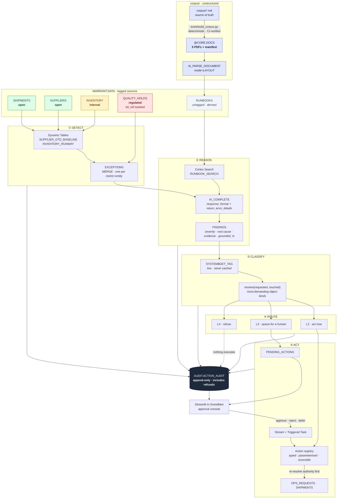

# Architecture

Everything runs inside Snowflake. There is no external orchestrator, no external inference,
and no copy of the data anywhere else.

Three constraints converge on that answer:

1. **External Access Integrations are disabled on trial accounts**, so a UDF cannot call out.
2. **Snowpark Container Services is unavailable on trial**, so there is nowhere to host a sidecar.
3. The rules mandate use of the Snowflake platform and explicitly reward breadth of native
   service use.

The result is not a compromise. An agent that reasons about governed data from *outside* the
governed perimeter has to be told what it is allowed to touch, in configuration somebody
maintains by hand. An agent running inside Snowflake can **read the classification already
attached to the object**. The permission and the data live in the same system, which is the
only version of this that survives an audit.

## The loop

## CoCo Agent Skills, and where each one lands

The five skills in [`.cortex/skills/`](../.cortex/skills/) map one-to-one onto the phases
above, and each names the module that implements it.

| Skill | Phase | Implemented by |
|---|---|---|
| `detect-anomaly` | ① | `warrant/detect/exceptions.py` |
| `investigate-root-cause` | ② | `warrant/reason/investigate.py` |
| `classify-authority` | ③ | `warrant/authority/tags.py` + `tiers.py` |
| `propose-action` | ④ | `warrant/act/registry.py` |
| `orchestrate-loop` | ①–⑤ | `warrant/orchestrate/loop.py` |

## Why the tag is the control

Four tables carry four different classifications, so one loop produces four different
outcomes without a single branch on a table name:

| Source | Tag | What the agent may do | Observed |
|---|---|---|---|
| `SHIPMENTS`, `SUPPLIERS` | `open` | Act unsupervised, then log it | SUP-002 → `open_supplier_case`, **executed** |
| `INVENTORY` | `internal` | Propose only; a human approves | SKU-1003 → `raise_replenishment`, **queued** |
| `QUALITY_HOLDS` | `regulated` | Read and explain; never act | 4 aging holds → `notify_quality_owner`, **permitted because it only drafts** |
| `RUNBOOKS` | *untagged* | Treated as unclassified, not as cleared | Retrieval is a read, so grounding still works |

`resolve()` takes the **most demanding** object in an action's footprint, never the least. An
earlier revision took the minimum, which let a single `open` table dilute a `regulated` one;
`tests/test_tiers.py` carries a named regression test for it.

Reads and drafts (tier ≤ `DRAFT`) are exempt from the tags entirely. Without that exemption
the agent could not detect an aging quality hold and explain it — which RB-003 explicitly
permits, and which is the difference between a useful agent and a silent one. **The agent may
look and speak; it may not touch.**

## The second control: what the agent may see

That exemption is deliberate, and it leaves a gap the tag cannot close. If reads are unbounded,
an agent forbidden from acting on a regulated record can still read every field of it. So the
tag is not the only control — `QUALITY_HOLDS.lot_ref` carries a **masking policy**.

| Control | Answers | Enforced by |
|---|---|---|
| `SENSITIVITY` tag | *What may the agent do to this record?* | `resolve()` at proposal **and** execution time |
| `LOT_REF_MASK` | *What may the agent know about this record?* | Snowflake, on every read, for every role |

The split follows RB-003 exactly. Surfacing an aging hold needs its age, site, SKU and reason;
it does not need the lot identifier, and the lot identifier is precisely what makes a record
actionable. So the qualified person — a separate `WARRANT_QUALITY_OWNER` role — sees
`LOT-080238`, and the agent, running as `WARRANT_ROLE`, sees `LOT-WITHHELD`. Same table, same
query, two answers. **The agent cannot name the thing it is forbidden to touch.**

Two details worth noticing, because both were choices:

- The policy **redacts rather than pseudonymises**. A digest would look more sophisticated, but
  `lot_ref` is drawn from a domain of forty known values, so any hash of it is reversible by
  brute force in milliseconds. A pseudonym here would be security theatre.
- `WARRANT_ROLE` is granted `APPLY` on that one policy, **not** `APPLY MASKING POLICY ON
  ACCOUNT`. The broader privilege would let the agent's own role attach a permissive policy
  elsewhere and read its way around the control. The narrow grant is what makes the policy
  something the agent is subject to rather than something it administers.

The policy is attached in `sql/10_synthetic_data.sql`, next to the tags and for the same reason:
`CREATE OR REPLACE TABLE` silently drops every tag and policy on the table it replaces, so a
control applied once at setup would vanish the first time anyone regenerated the data.

## The corpus is untrusted input

Grounding improves the agent's reasoning and enlarges its attack surface at the same time. A
retrieved document is data from outside the trust boundary, and it lands in a prompt. If an SOP
can be edited — or if one arrives from a supplier, a regulator or a document pipeline — then
"the agent follows the procedure" and "the agent follows the attacker" are the same sentence.

Warrant's answer is that **no security property depends on the model's judgement.** Three
structural facts do the work:

1. **The model chooses only `action_type` and `action_params`.** `requested_tier` and
   `touched_objects` are copied from the registry. There is no field in the response schema for
   authority or footprint, so a document cannot ask for more of either.
2. **Sensitivity is read from the object, not from the reply.** A document asserting that a table
   is `open` is asserting it into a channel that does not exist.
3. **The model never contributes SQL text.** `action_type` is a closed enum; parameters are bound.
   `tools/lint_sql_boundary.py` fails the build if any module composes SQL from runtime data.

`corpus/adversarial/` holds a document that attacks all three, plus entity substitution and audit
suppression. `scripts/injection_drill.sh` puts it through the real retrieval path — it ranks first
for a quality query and is cited by every finding in the run. `tests/test_adversarial.py` then
asserts the outcomes **on the assumption that the model complied with it entirely**, which is the
only form of the claim worth making: a model that resists today is a model that might not resist
after the next version bump, whereas a reply that has nowhere to put an escalation cannot escalate.

## Two decisions worth defending

**Authority is resolved twice — once at proposal, again at execution.** The tier stored on a
queued action records what was true when it was proposed. That is evidence, not permission.
`warrant/act/executor.py` re-reads the tags before it binds anything, so an action a human
already approved against `internal` data still refuses if the table became `regulated` in the
interim, and says so in the audit rationale. A control consulted once and then trusted forever
documents policy rather than enforcing it.

**The model chooses what to do; the registry declares what it costs.** `action_type` is pinned
to an enum of implemented actions, `action_params` are bound as query parameters, and
`requested_tier` and `touched_objects` are copied from `warrant/act/registry.py` — never from
the model, because an action able to nominate its own authority or under-declare its own
footprint would defeat the entire mechanism. `tools/lint_sql_boundary.py` fails the build if
any module composes SQL from runtime data, so *"the model cannot write SQL"* is enforced rather
than asserted.

## Where the thresholds come from

Every number in the detectors is quoted from the runbook corpus rather than chosen by the
author: RB-001's twenty percentage points, RB-002's fourteen days of cover, RB-003's sixty
days. The documents the detectors implement are the same ones Cortex Search retrieves for the
reasoning step — so a conclusion can cite the clause that set the threshold that raised it.

The supplier detector pairs RB-001's threshold with a robust z-score (median and MAD, not mean
and standard deviation, because the outlier being hunted would otherwise inflate the spread it
is measured against). On the live data SUP-002 scores −3.63 while the next-worst supplier
scores −0.46, so the statistical test and the runbook threshold agree independently.

See the [README](../README.md) for the Snowflake service inventory and
[`judges_walkthrough.md`](judges_walkthrough.md) for a reproduction.
